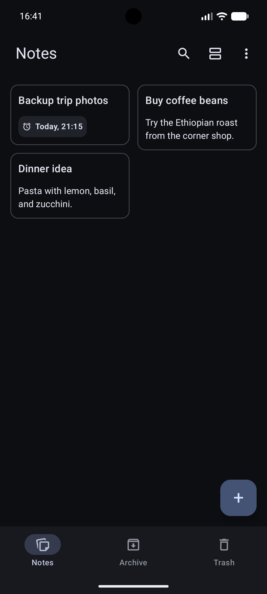
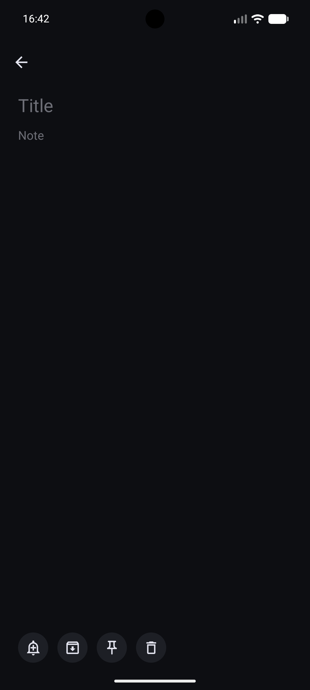

<h1 align="left" style="vertical-align: middle;">
   Noted
</h1>

[](https://github.com/devmatteini/noted/actions/workflows/ci.yml)


Not every note belongs in a knowledge system, like a second brain.

Noted is Android app for short-lived notes, quick thoughts, and small things you need to remember
without making them permanent knowledge. Reminder notifications make notes useful as lightweight
todos or memory nudges.

It works completely offline on you device.

[Features](#features) •
[Installation](#installation) •
[Usage](#usage) •
[Contributing](#contributing) •
[License](#license)

<p>
  
  
</p>

## Features

- Create and edit notes with autosave
- Pin important notes
- Exact reminder notifications
- Launcher shortcut to create a new note
- Archive notes without deleting them
- Search notes
- Automatic permanent deletion of discarded notes after 30 days
- Export and import notes backups
- No cloud synchronization available

## Installation

Your device needs to run Android version 15+.

### Prebuilt APK

Download the prebuilt versions of `Noted` from
the [latest release](https://github.com/devmatteini/noted/releases/latest).

### From source

```shell
git clone https://github.com/devmatteini/noted && cd noted
make release
file ./app/build/outputs/apk/release/app-release.apk
```

## Contributing

Take a look at the [CONTRIBUTING.md](CONTRIBUTING.md) guidelines.

## License

`Noted` is made available under the terms of the MIT License.

See the [LICENSE](LICENSE) file for license details.
